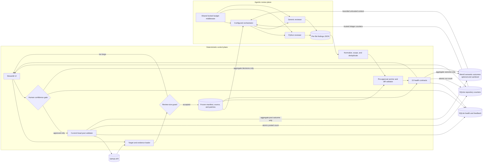
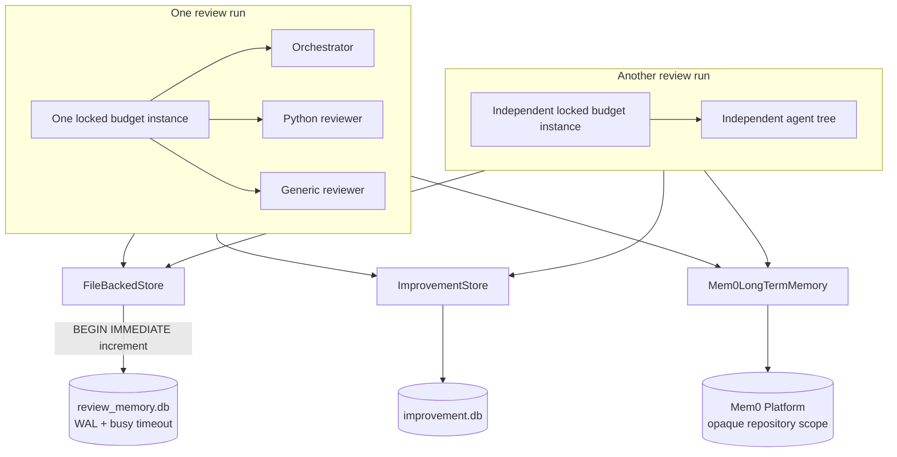
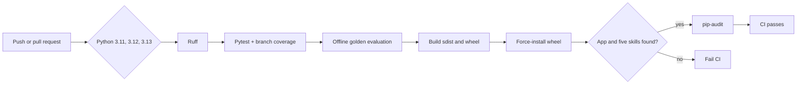

# Quorum — Architecture

For the visual system flows, event-by-event runtime narrative, operator
checklists, and UI captures, see the
[Operations and Event Guide](docs/OPERATIONS_GUIDE.md).

## Runtime architecture

The image provides the presentation view; the Mermaid diagram below is the
maintainable component-and-authority map. The presentation image is generated
from [`docs/diagrams/quorum-system-overview.mmd`](docs/diagrams/quorum-system-overview.mmd);
the [diagram README](docs/diagrams/README.md) contains the reproducible render
command.

Arrows crossing out of the agentic plane carry findings or usage telemetry,
not authority. Models cannot select a different target, change frozen evidence,
write persistent stores, or reach the GitHub posting API.

## Component reference

| Component | Type | LLM calls | Responsibility |
| --- | --- | --- | --- |
| `app.py` | Streamlit entry point | 0 | Collects owner/repo/PR, buckets findings by confidence, renders Approve/Reject, calls `post_approved_review`. |
| Trusted review loader | Deterministic Python | 0 | Freezes PR metadata, head SHA, eligible manifest, source, and patches before the graph starts. |
| Review-size guard | Deterministic Python | 0 | Refuses a run before model execution if eligible file count or aggregate source characters exceed configured limits. |
| Review orchestrator | Deep agent (loop) | variable | Built by `create_deep_agent`. Inspects the frozen VFS, decides per file whether to delegate, consolidates findings, emits `FINAL_FINDINGS_JSON`. |
| `python_reviewer` | Subagent | variable | Spawned via `task` for `.py` files. Loads three Python skills, runs bandit in the sandbox, writes `/findings/<repository-path>.json`. |
| `generic_reviewer` | Subagent | variable | Spawned for non-Python files. Loads two generic skills. No bandit — it is Python-only. |
| `PRMetadataMiddleware` | `wrap_model_call` hook | 0 | Reasserts the human-selected repository, PR number, and SHAs on every call. Untrusted title/body are available only through a bound tool. |
| `CostTrackingMiddleware` | `before_model` + `after_model` hooks | 0 | Reserves calls before execution, logs token cost after responses, and stops the shared run at its configured thresholds. |
| Tools | Bound `@tool` functions | 0 | Frozen-target `fetch_pr`, `list_files`, `get_file_content`, and path-bound `regex_search`; constrained `run_command`. No target parameters or posting tool are exposed to the model. |
| Skills | Markdown | 0 | Pattern knowledge loaded on demand from `/skills/<name>/SKILL.md`. |
| Virtual filesystem | `ReviewStateBackend` | 0 | Preloaded `/pr/` and `/patches/` evidence is immutable. Agents can mutate only safe `/findings/**/*.json` paths. |
| `FileBackedStore` | Persistent store | 0 | Transactional per-repo statistics in SQLite under `~/.quorum_memory/`; imports the legacy JSON format once. |
| `ImprovementStore` | SQLite | 0 | Run health, deduplicated recurring issues, human decisions, and sanitized evaluation cases. |
| `Mem0LongTermMemory` | Hosted semantic adapter | 0 | Optionally retrieves bounded repository-scoped outcome history and writes deterministic aggregate review, decision, and posting summaries. It is never a source of truth. |
| Frozen-candidate validator | Deterministic Python | 0 | Re-anchors candidates against frozen source and rejects missing anchors or lines outside the frozen added-side diff before approval. |
| Health evaluator | Deterministic Python | 0 | Checks source/diff integrity, per-file artifacts, finding paths/anchors/lines/postability, completion, truncation, and budget. |
| Confidence gate | UI logic | 0 | Auto-approve at/above threshold; manual decision below. |
| `post_approved_review` | Deterministic Python | 0 | Re-anchor → unidiff validate → one `create_review` call. |
| `quorum-eval` | Offline CLI | 0 | Scores exact path/line/category identity plus anchor accuracy and enforces precision, recall, F1, and anchor thresholds. |
| `quorum-review` | Installed CLI | 0 | Resolves the source or packaged Streamlit entry point and launches the UI with bundled skill resources. |

Total LLM calls per run is variable — the orchestrator chooses how many files
to delegate, and each subagent runs its own loop. The call ceiling is exact:
call 26 is never started when the limit is 25. Dollar cost is only known after
a provider responds, so the configured amount is a post-response stop threshold.

## Data flow

1. `run_review` fetches PR metadata and freezes the eligible manifest at one
   head SHA. While loading source, it enforces the file-count and aggregate
   character limits; an oversized review fails rather than becoming partial.
2. Trusted Python preloads `/pr/<path>` plus `/patches/<path>.patch` before the
   model runs.
3. Trusted Python loads local integer counters and optionally retrieves bounded
   Mem0 history through a fixed source-free query and an opaque repository ID.
   Retrieved text is explicitly marked untrusted and informational. The
   orchestrator can list only the frozen target and reads immutable source from
   the VFS; no model tool can read or write any persistent memory.
4. Per file, it delegates via
   `task(subagent_type="python_reviewer" | "generic_reviewer")`.
   The subagent reads from `/pr/<name>` and writes `/findings/<name>.json`.
   Source remains ephemeral graph state and is never copied into persistent
   memory or improvement records.
5. The orchestrator reads the findings files back. Deterministic Python filters
   out-of-manifest paths, drops `low`, and deduplicates by `(path, line)` while
   retaining the strongest candidate.
6. Deterministic Python re-anchors candidates against frozen source and removes
   anything that cannot post on the frozen added-side diff.
7. The health evaluator compares final state and pre-approval validation results
   with the frozen inputs. Run data and recurring failures are persisted in
   SQLite without source or finding prose. A fixed-schema aggregate outcome is
   also sent to Mem0 when enabled.
8. The UI buckets the postable candidates by confidence; the human approves or
   rejects and can save those decisions as evaluation labels without posting.
9. `post_approved_review` verifies the head SHA is still current, requires a
   real anchor, re-anchors to an added diff line, and posts one review.
10. Human decisions and actual posted/postability-failure outcomes become
    SQLite evaluation labels and sanitized Mem0 aggregates. Repository run and
    posted-comment counters are incremented transactionally so concurrent
    sessions cannot overwrite each other.

## Concurrency and persistence

There are two distinct concurrency domains:

Within one run, the orchestrator and separately compiled subagent graphs may
overlap model calls. They share a single `CostTrackingMiddleware` lock, so call
reservation, token totals, logs, and per-model rollups remain coherent.
Different Streamlit sessions own independent agent trees, but their aggregate
repository counters converge through an atomic SQLite read-modify-write.

Feedback has two independent dimensions: human disposition and posting
outcome. Updating one dimension first deletes its opposite label, so a finding
cannot remain both `approved` and `rejected`, or both `posted` and
`postability_failure`. Updating human disposition does not erase posting
history, and vice versa.

SQLite supports concurrent processes sharing one local volume. It is not used
as a distributed lock across hosts. A multi-host deployment needs sticky access
to one writer volume or store adapters backed by a managed transactional
database; agent/VFS state remains isolated per run. Mem0 is a hosted additive
layer and can be shared across hosts, but it does not provide transactional
counter, issue-lifecycle, or feedback-label semantics. Each process deduplicates
identical same-session Mem0 events; the hosted service remains authoritative for
cross-process semantic-memory behavior.

## Configuration and budget semantics

Configuration is resolved once into an immutable `ReviewSettings` value for a
run. Provider, profile, effort, booleans, confidence, output tokens, cost, calls,
file count, and aggregate source size are validated strictly. Unknown choices,
empty model overrides, malformed booleans, and out-of-range numbers raise
`ConfigurationError`; no provider or profile silently falls back.

The budget has two enforcement points:

1. `before_model` locks and reserves a call. If the configured limit is already
   reached, no provider request starts. With a limit of 25, call 26 is never
   sent, even when subagents call concurrently.
2. `after_model` records reported tokens and cache tiers, computes spend, and
   stops the graph if cumulative cost crossed the configured threshold. Exact
   cost is unavailable before a response, so one response may overshoot the
   dollar threshold; the next request will not start.

Budget interruption is recoverable. The graph checkpoint is read after an
exception and any completed `/findings/` artifacts are returned with an
incomplete-run health failure rather than discarded.

Configuration constants are imported once per Python process. Streamlit can
hot-reload `app.py` while retaining an older imported module, so changes to
`quorum.config`, `.env`, or installed dependencies require a full process
restart. This is a development-runtime constraint, not a Mem0 fallback path.

## Packaging and quality gates

The wheel installs the `quorum-review` and `quorum-eval` entry points. `app.py`
and the five skill directories are data resources under `share/quorum`; runtime
resolution checks an explicit `QUORUM_SKILLS_DIR`, the source checkout, then
the installed data directory. The source distribution also includes the app,
skills, and sanitized evaluation fixtures.

CI is fully offline through the test/evaluation stages. It requires the Ruff
rules configured in `pyproject.toml`, the 65% branch-aware coverage floor, and
perfect precision, recall, F1, and anchor accuracy on the checked-in smoke
fixture before building. `pip-audit` is the only gate that needs vulnerability
advisory data from the network.

## Deviations from the specification

The specification was written against an earlier deepagents API. These six API
adaptations keep the design running on the installed version (`deepagents`
0.7.9).

1. **Skills are directories, not flat files.** `SkillsMiddleware` expects
   `skills/<name>/SKILL.md` with YAML frontmatter (`name`, `description`), so
   the five skills are directories rather than loose `.md` files.

2. **Subagents receive skill *paths*, not names.** `skills=["/skills/python-sql-injection"]`,
   not `skills=["python-sql-injection"]`. Custom subagents do not inherit the
   parent's skills, so each lists its own.

3. **The task tool takes `subagent_type=` — as the specification said.**
   This was briefly "corrected" to `name=` on the strength of published docs
   that describe a different version of the library. The installed tool's real
   signature is `task(description, subagent_type)`, so the specification was
   right and the correction was wrong; the prompt now matches the tool. The
   run still worked while the prompt was wrong, because the model reads the
   bound tool schema rather than trusting prose — a useful reminder that a
   prompt instruction is a hint and the schema is the contract.

4. **`run_command` resolves virtual paths itself.** The spec's
   `bandit -ll /pr/app.py` cannot work literally — `/pr/` exists only in agent
   state, and bandit is a real subprocess. The tool reads the path through the
   backend, materializes it to a temp file, runs the scanner, and deletes it.
   File content never passes through LLM context to get there. The scanner
   binary is resolved from the running interpreter's `bin` directory, which is
   not on `PATH` when the app is launched by absolute interpreter path.

5. **PR identity arrives via runtime context and folds into the system
   prompt.** Identity is fetched
   deterministically before the agent starts, which also gives the post step a
   trusted `head_sha` that never depends on the LLM. And the middleware uses
   `wrap_model_call` rather than appending a `SystemMessage` in `before_model`
   — a system message landing after the first human turn is non-consecutive,
   which the Anthropic API rejects outright. PR titles, bodies, patches,
   filenames, and source are explicitly treated as untrusted data rather than
   system instructions.

6. **The budget guard is attached to the subagents too.** Subagents are
   separately compiled graphs, so parent middleware does not propagate into
   them. One shared `CostTrackingMiddleware` instance is passed to the
   orchestrator and both subagents; a ceiling on the orchestrator alone would
   not bound the run.

## Robustness measures beyond the specification

- **Finding normalization.** Models reliably produce the right findings but
  drift on field names — emitting `comment` instead of `body`, or omitting
  `category`. Rather than discarding a valid critical finding over a key name,
  aliases are mapped and a missing category is inferred from content. An
  unscored finding is parked just below the default threshold so a human
  adjudicates it instead of it vanishing.
- **Findings-file fallback.** If the `FINAL_FINDINGS_JSON` marker is missing or
  malformed, findings are consolidated deterministically from `/findings/*.json`
  in the final state. A bad final message never costs a whole run's work.
- **Budget-kill recovery via checkpointing.** A run halted by the ceiling still
  returns whatever reached `/findings/`, flagged so the UI can say the results
  are incomplete. This requires a checkpointer: when the ceiling fires,
  `invoke()` raises and returns no state at all, so the only way to reach
  findings already written to the VFS is to read them back out of the last
  checkpoint via `agent.get_state()`.

- **Cache-aware cost accounting.** deepagents applies Anthropic prompt caching
  automatically. `usage_metadata["input_tokens"]` is the *total* and already
  includes the cached portion, so pricing every input token at the base rate
  overstates a run by roughly 10x on cache reads — enough to trip the kill
  switch on a run comfortably within budget. The three tiers are priced
  separately: uncached at 1.0x, cache reads at 0.1x, cache writes at 1.25x.
  In practice caching carries almost the entire prompt: measured runs show
  `uncached=2` tokens per call once the cache is warm.
- **Frozen-target tools.** The tool schemas do not accept owner, repository, PR,
  or ref arguments. `regex_search` accepts a pattern and safe `/pr/` path, then
  reads content from the backend; it does not accept full source text from the
  model. A model cannot redirect a run after reading hostile PR content, and
  findings outside the frozen eligible manifest are discarded.
- **Pre-approval postability.** Frozen source and patch evidence are parsed
  before the confidence gate. Missing anchors and off-added-side lines are
  removed before they can consume human attention; corrected lines are visible
  in the trace. Posting repeats the checks against current GitHub state.
- **Durable improvement evidence.** Health-contract failures are fingerprinted
  by repository and invariant. Human decisions and posting outcomes are saved
  as sanitized evaluation cases. Duplicate persistence of the same run is
  idempotent: it does not inflate issue occurrences or reopen a closed issue,
  but it does still record a contract that failed for the first time.

## Trust boundaries

| Boundary | Policy |
| --- | --- |
| PR content | Titles, descriptions, diffs, filenames, and source are untrusted input. Only identity fields enter the system prompt. |
| Target | GitHub tools are bound to one human-selected PR, frozen head SHA, and eligible manifest. |
| Source evidence | Trusted Python preloads it. Agents cannot write, edit, delete, or upload under `/pr/` or `/patches/`. |
| Shell | Bandit only; a validated read-only reporting grammar, exact `/pr/` file targets, argv-only execution, no shell, 60s timeout, and a temporary cwd. |
| Host filesystem | Run artifacts live in agent state; `/skills/` is read-only. SQLite and aggregate run statistics are the only intended persistent writes. |
| Comment placement | The reviewed head must still be current; anchors must exist; only lines on the `+` side are posted. |
| Posting | Requires explicit human approval. The agent has no posting tool. |
| Spend | Exact pre-call count ceiling plus a post-response dollar stop threshold, enforced by one locked middleware instance shared across orchestrator and subagents. |
| Improvement data | Stores metadata and anchor hashes, never source, patches, PR prose, finding bodies, suggestions, or anchor text. |
| Mem0 data | Optional hosted storage receives an opaque repository hash and aggregate counts/enums only. Retrieved text is bounded and treated as untrusted; failures fall back to local stores. |
| Credentials | Read from `.env`, which is git-ignored. Never enter the VFS or a prompt. |

Reviews also fail before model execution if eligible input exceeds the
configured file-count or aggregate-character limits; Quorum never silently
substitutes a partial review. Skills and `app.py` are wheel data resources, so
the same boundaries apply to editable and installed execution.

## Current scope limits

- Removed files are skipped because GitHub posting is currently implemented
  only for the added/right side of a diff.
- A single source file is truncated after 100,000 characters and causes the
  `source_truncation` health check to fail. Aggregate source above the configured
  limit is refused instead of truncated.
- SQLite persistence is safe for concurrent sessions on a shared local volume,
  not for independent multi-host writers without a shared transactional store.
- Mem0 is optional and best effort. Service unavailability removes semantic
  history for that operation but never bypasses deterministic validation or
  loses the local transactional record.
- The checked-in evaluation pair is a harness smoke test, not a statistically
  meaningful quality benchmark. Production calibration needs multiple
  sanitized golden PR cases with reviewed false-positive and false-negative
  labels.
- Exact dollar preauthorization is impossible with provider-reported token
  usage; the call ceiling is exact, while cost is a post-response stop threshold.

## Historical measured behavior

These measurements predate the frozen-source and improvement-loop hardening.
They remain a useful baseline, but should be rerun before using them as current
cost or quality guarantees.

Three real public pull requests, dry run (no posting), `claude-opus-5`
orchestrator + `claude-sonnet-5` subagents, $1.00 ceiling:

| PR | Shape | Calls | Cost | Findings |
| --- | --- | --- | --- | --- |
| `psf/requests#6642` | 7 files, mixed config + docs | 21 | $0.76 | 2 (both held for review) |
| `psf/requests#6710` | 1 Python file, real code change | 15 | $0.81 | 3 (1 auto-approved, 2 held) |
| `pallets/flask#5514` | 3 dependency-pin files | 18 | $0.65 | 0 |

All three completed inside the ceiling. On `#6710` every anchor was verified
against the file at head and every finding landed on the `+` side of the diff,
so all three would post. The zero-finding result on `#5514` is correct — a
dependency version bump has nothing to report, and the run produced no false
positives.

A synthetic file with four planted vulnerabilities (hardcoded password, API
key, f-string SQL injection, `os.system` command execution) was detected 4/4
with exact line numbers and verbatim anchors.

### Cost characteristics

A run costs roughly $0.65–$0.85 on PRs of this size. The dominant cost is not
file content but the per-call fixed overhead — system prompt, tool schemas, and
skill metadata — resent on every call. Prompt caching absorbs almost all of it
once warm. The $1.00 ceiling is workable for PRs up to roughly ten changed
files; beyond that, raise `REVIEW_MAX_COST_USD` rather than let the kill switch
truncate a run.

### Known model-behavior variance

The model can still omit a per-file findings artifact or produce an invalid
anchor. Those conditions no longer look like a clean review: deterministic
health checks surface them in the UI and create deduplicated improvement
issues. The post boundary independently rejects invalid or stale comments.
