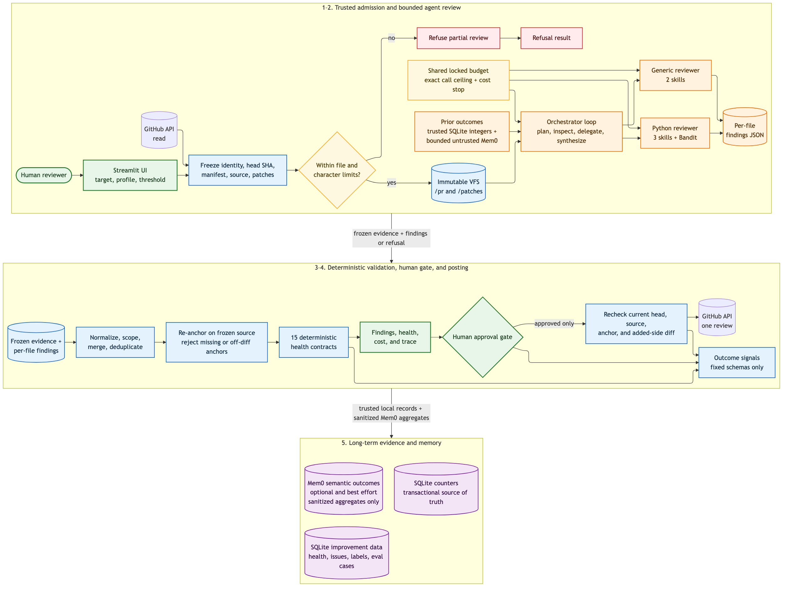
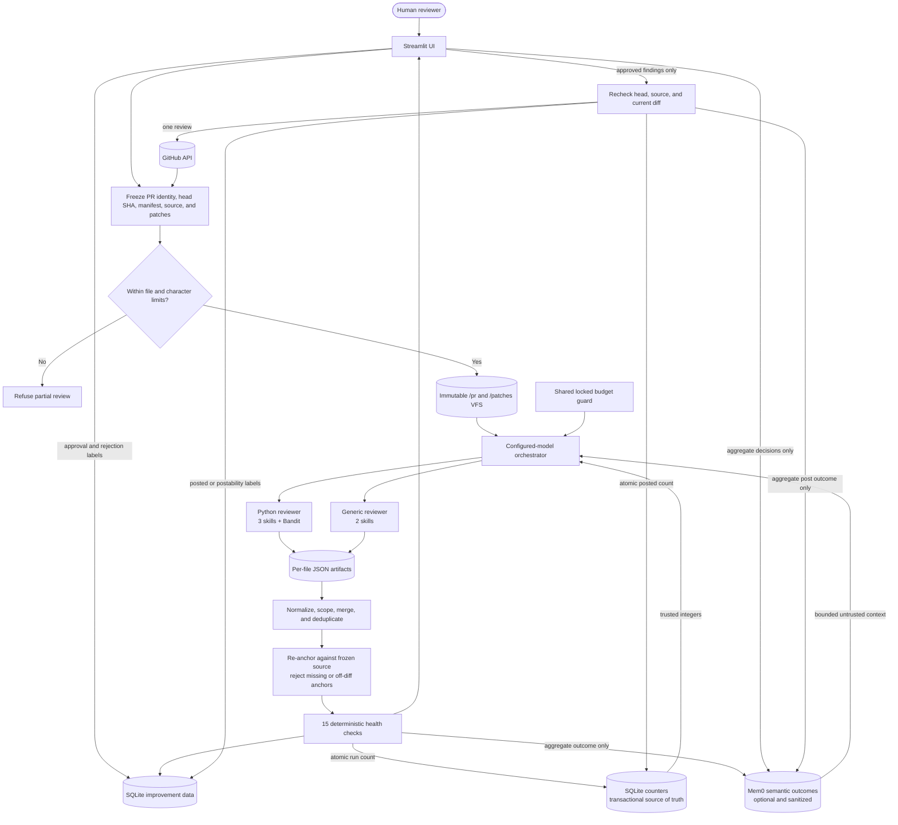
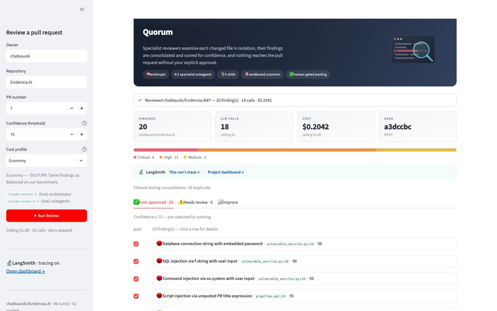
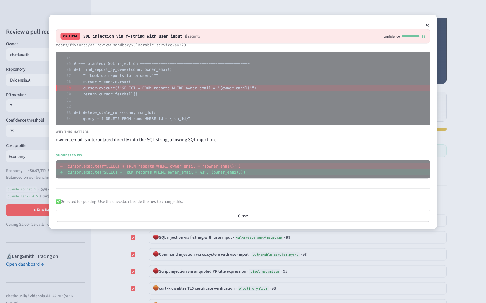
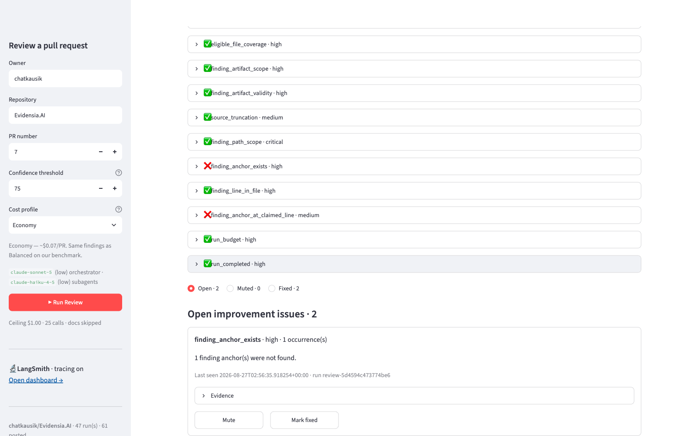

# Quorum

**A deep-agents code reviewer that never posts without your approval.**

Quorum reviews a GitHub pull request for correctness, security, and
test-coverage issues. It decides on the fly which tools to call, which files to
delegate to a specialist subagent, and which skills to load — rather than
following a hardcoded fetch → parse → review sequence.

The name is the design: findings need enough confidence to pass the gate, and a
human casts the deciding vote before anything is posted.

Findings surface in a Streamlit UI bucketed by confidence. You approve what
should go out, and a single GitHub review is posted with every comment prefixed
with its AI-review attribution, severity, and category.

## How it works



The illustrated overview shows the complete product boundary. The Mermaid flow
below is the concise editable companion used to keep the runtime sequence
current. The static image is generated from
[`docs/diagrams/quorum-system-overview.mmd`](docs/diagrams/quorum-system-overview.mmd).



The orchestrator is a loop, not a pipeline. What is *not* left to the model:
the budget ceiling, target and head SHA, eligible-file manifest, source
mounting, input-size limits, line-number and diff validation, health evaluation,
and the decision to post.

## What it looks like

Captured from a live Economy-profile run against the public sandbox PR
`chatkausik/Evidensia.AI#7`.

**Findings are one row each — severity, description, `file:line`, confidence.**
Rows at or above the threshold arrive pre-selected for posting.



**Clicking a row opens the evidence, not more prose:** the offending line
highlighted in context, why it matters, and a colour-coded suggested fix.



**The Improve tab is the thing to read before trusting a low finding count.**
Fifteen deterministic contracts are evaluated against trusted run state rather
than model claims; failures become fingerprinted, recurring issues.



_The screenshot documents the issue workflow from the earlier 13-contract UI;
the current runtime adds `diff_availability` and `finding_postability`._

The [operations guide](docs/OPERATIONS_GUIDE.md#ui-screenshots) has the full
set, including the empty state and a run in progress.

## Documentation

- [Operations and event guide](docs/OPERATIONS_GUIDE.md) — annotated runtime
  flows, event catalog, model routing, health contracts, feedback lifecycle,
  posting boundary, and screenshot plan.
- [Architecture reference](ARCHITECTURE.md) — component contracts, trust
  boundaries, concurrency and scaling model, packaging, API adaptations, and
  historical benchmark notes.
- [Evaluation guide](evals/README.md) — golden-fixture format, scoring identity,
  threshold gates, and safe benchmark expansion.

## Setup

```bash
python3 -m venv .venv
.venv/bin/pip install -e ".[dev]"
cp .env.example .env      # then fill in GitHub + the selected model provider
```

`.env` needs a GitHub credential and a key for the selected model provider:

| Variable | Default | Purpose |
| --- | --- | --- |
| `MODEL_PROVIDER` | `openai` | `openai` or `anthropic`; any other value fails startup. |
| `OPENAI_API_KEY` | — | Required when OpenAI is selected. |
| `ANTHROPIC_API_KEY` | — | Required when Anthropic is selected. |
| `GITHUB_TOKEN` | `gh auth token` fallback | Reads the PR and posts an approved review. Use a classic PAT with `repo`, or fine-grained *Pull requests: read and write*. |
| `REVIEW_COST_PROFILE` | `balanced` | `economy`, `balanced`, or `thorough`. |
| `REVIEW_MAX_COST_USD` | `1.00` | Post-response cost stop threshold for the complete agent tree. |
| `REVIEW_MAX_LLM_CALLS` | `25` | Exact pre-request call ceiling shared by orchestrator and subagents. |
| `REVIEW_MAX_FILES` | `50` | Maximum eligible files; excess input is refused before model execution. |
| `REVIEW_MAX_TOTAL_CHARS` | `1000000` | Maximum aggregate frozen source size. |
| `REVIEW_CONFIDENCE_THRESHOLD` | `75` | Findings at or above this score start selected in the UI. |
| `REVIEW_DOCS` | profile default | Include markdown/documentation files when `true`. |
| `REVIEW_MEMORY_DIR` | `~/.quorum_memory` | SQLite-backed aggregate repository counters. |
| `REVIEW_IMPROVEMENT_DB` | `<memory dir>/improvement.db` | Health runs, recurring issues, decisions, and sanitized evaluation cases. |
| `MEM0_API_KEY` | disabled | Enables optional hosted semantic memory when set to a real key. |
| `MEM0_ENABLED` | auto | Explicitly enable or disable Mem0; defaults to enabled when `MEM0_API_KEY` is present. |
| `MEM0_APP_ID` | `quorum-code-review` | Separates Quorum memories from other applications in the same Mem0 account. |
| `MEM0_TOP_K` | `8` | Maximum repository-scoped memories requested for one review. |
| `MEM0_MAX_CONTEXT_CHARS` | `4000` | Hard limit on retrieved Mem0 text added to the task. |
| `MEM0_TIMEOUT_SECONDS` | `10` | Hosted-memory request timeout; failures fall back to local-only operation. |
| `LANGSMITH_API_KEY` | disabled | Enables tracing and in-app trace links when set to a real key. |
| `QUORUM_SKILLS_DIR` | auto-detected | Optional override for custom/nonstandard skill installations. |

Configuration fails closed: unknown providers/profiles, invalid booleans, and
out-of-range limits stop startup rather than silently selecting a fallback.
Private PR source is sent to the selected model provider. If LangSmith tracing
is enabled, prompts, tool calls, source excerpts, and model responses may also
be retained by LangSmith; review its access and retention settings before using
tracing on private repositories. When Mem0 is enabled, Quorum sends only
deterministic aggregate outcome summaries under an opaque SHA-256-derived
repository ID. It does not send raw repository names, source, patches, paths,
PR text, finding prose, suggestions, anchors, line locations, SHAs, review
URLs, or provider errors.

### Cost profiles

Pick a profile in the sidebar, or set `REVIEW_COST_PROFILE`. Profiles resolve
strictly within the selected provider:

| Profile | OpenAI orchestrator / subagent | Anthropic orchestrator / subagent | Effort | Docs |
| --- | --- | --- | --- | --- |
| `economy` | `gpt-5.4-mini` / `gpt-5.4-nano` | `claude-sonnet-5` / `claude-haiku-4-5` | low / low | skipped |
| `balanced` | `gpt-5.4` / `gpt-5.4-mini` | `claude-sonnet-5` / `claude-sonnet-5` | medium / low | skipped |
| `thorough` | `gpt-5.5` / `gpt-5.4` | `claude-opus-5` / `claude-sonnet-5` | high / medium | included |

On one measured four-file PR with roughly 20 findings, Economy and Balanced
returned the same findings at approximately $0.07 and $0.23 respectively.
Treat those numbers as historical observations, not price guarantees; model
pricing, cache behavior, PR shape, and provider all affect a run.

## Run

```bash
.venv/bin/quorum-review
```

For source-only development, `.venv/bin/streamlit run app.py` is equivalent.
The `quorum-review` command also works from an installed wheel and resolves the
packaged Streamlit entry point and five bundled skills without relying on the
checkout directory.

After changing configuration exports or upgrading dependencies while the UI is
running, stop the existing Streamlit process with Ctrl-C and start it again.
Streamlit hot reload can retain an already-imported Python module; a full
restart ensures new `.env` values and exports such as `MEM0_API_KEY` are loaded.

Enter owner, repository, and PR number, then click **Run Review**. Findings
appear in two buckets:

- **confidence ≥ threshold** — auto-approved, pre-checked for posting
- **confidence < threshold** — held back for an explicit decision

Adjust the threshold in the sidebar (default 75). Click **Post Approved
Comments** to publish, or **Download findings report** for a prioritized
markdown report.

## Tests

```bash
.venv/bin/python -m pytest
.venv/bin/ruff check .
.venv/bin/python -m pytest --cov=quorum --cov-report=term-missing
```

Covers line-number re-anchoring, stale-head rejection, bound GitHub tools,
immutable VFS boundaries, scanner argument validation, the cost kill switch,
health contracts, finding normalization, concurrent SQLite increments,
contradictory-label replacement, package resource discovery, and review-size
refusal. Mem0 tests inject a fake client and assert repository scoping,
context bounds, failure isolation, idempotency, and privacy exclusions. No
network or credentials are required.

Recorded outputs can be scored for precision, recall, F1, and anchor accuracy:

```bash
quorum-eval evals/fixtures/expected.json evals/fixtures/actual.json \
  --min-precision 1 --min-recall 1 --min-f1 1 --min-anchor-accuracy 1
```

CI runs these gates on Python 3.11, 3.12, and 3.13, requires at least 65%
branch-aware coverage, audits installed dependencies, builds both distribution
formats, force-installs the wheel, and verifies that the app and skill resources
survive installation.

To reproduce the package check locally:

```bash
.venv/bin/python -m build
.venv/bin/pip-audit
```

## Design notes

**Skills are markdown, not prompt strings.** The five files under `skills/`
hold the pattern knowledge — regexes, severity guidance, worked good/bad
examples. A security team can update a pattern by editing markdown, with no
redeploy, and anyone can read what the agent "knows" without reading code.

**Subagents are specialists.** `python_reviewer` gets bandit and the three
Python skills; `generic_reviewer` gets neither, because bandit is Python-only.
Smaller tool sets produce sharper findings.

**The budget guard is enforced, not requested.** `CostTrackingMiddleware`
reserves calls before execution, so a 25-call limit never starts call 26. Cost
is necessarily measured after a provider responds, so `$1.00` is a stop
threshold rather than a guarantee that the final response cannot overshoot it.
One shared, locked instance is attached to the
orchestrator *and* both subagents — subagents are separately compiled graphs,
so a ceiling on the orchestrator alone would not bound the run. A killed run
still returns whatever findings reached `/findings/`, recovered from the last
checkpoint.

Accounting is cache-aware: both providers cache prompts automatically, and
`input_tokens` already includes the cached portion, so charging it all at the
base rate overstates a run ~10x and trips the ceiling early. Cached input bills
at 10% of the input rate; Anthropic also charges a 1.25x premium to *write* the
cache, while OpenAI does not bill writes at all.

**Where the money goes.** On a measured run: output tokens 53%, cache writes
38%, cache reads 8%. Reasoning tokens bill as output, so `effort` is the
strongest single lever — hence the cost profiles. Docs and markdown are skipped
by default (`REVIEW_DOCS=true` to include them): prose is not code, and
reviewing it produces soft findings at real cost.

**LLMs hallucinate line numbers, so posting does not trust them.** Every
comment carries a verbatim `anchor_text`. Before posting, each comment is
re-anchored and checked against the frozen `+` side before it reaches the
approval UI. The post step repeats the same checks against current GitHub state
and rejects a stale head.

**HITL lives in the UI, not the framework.** The agent's job ends at "produce
candidate findings". Keeping the gate in the UI makes it provider-agnostic and
version-independent, and turns "add Slack approval" into a UI change rather
than an agent change.

**PR evidence is preloaded and immutable.** Trusted Python freezes the eligible
manifest and file content at one head SHA before the graph starts. `/pr/` and
`/patches/` are read-only to agents; they may only write JSON below
`/findings/`. The scanner accepts a narrow Bandit reporting grammar over exact
`/pr/` files and runs without a shell in a temporary directory. `/skills/` is
backed by source or installed package data and mounted read-only. The model's
`regex_search` tool accepts only a pattern and a safe `/pr/` path; source is
read from the frozen backend rather than copied back through a tool argument.

**Repository counters are safe across concurrent sessions.** Aggregate run and
posted-comment counters use transactional SQLite increments with WAL mode and a
busy timeout. Existing JSON counters are imported once. The separate
improvement database stores health and feedback metadata, and replaces labels
within mutually exclusive dimensions (`approved`/`rejected` and
`posted`/`postability_failure`) instead of retaining contradictions.

**Long-term memory has three deliberately different layers.**
`FileBackedStore` is the transactional source of truth for aggregate counters;
`ImprovementStore` is the transactional source of truth for health, issues,
human labels, and sanitized evaluation cases. Optional `Mem0LongTermMemory`
adds semantic recall across sessions and hosts. It searches with a fixed query,
uses an opaque SHA-256-derived repository entity ID, caps returned context, and
labels it untrusted before model use. Writes are deterministic aggregate
summaries only. Mem0 is additive and best effort: an SDK, network, credential,
or service failure never blocks review, feedback saving, or posting. See the
[Mem0 platform quickstart](https://docs.mem0.ai/platform/quickstart) and
[entity-scoped memory guide](https://docs.mem0.ai/platform/features/entity-scoped-memory)
for the hosted API model.

## Improvement loop

The implementation incorporates the useful control-loop patterns from
[agent-improvement-loop](https://github.com/yashprogrammer/agent-improvement-loop)
without giving the reviewer authority to rewrite its own code or open pull
requests:

1. Each run receives a stable ID and is evaluated against deterministic health
   contracts: frozen-source integrity, eligible-file coverage, finding scope,
   anchor validity, completion, and budget compliance.
2. Failed contracts are deduplicated into recurring improvement issues in
   SQLite. The **Improve** tab lists them by status and every transition is
   reversible: an issue can be muted, marked fixed, unmuted, or reopened. A
   recurrence reopens a fixed issue but leaves a muted one muted, and
   re-persisting the same run neither inflates its occurrence count nor
   reopens an issue a human closed.
3. Approval/rejection and actual postability are stored as evaluation labels.
   Use **Save Approval Feedback** to retain decisions even when nothing should
   be posted.
4. The stored evaluation payload contains repository/path/line and review
   metadata plus a one-way anchor hash. Source, patches, PR descriptions,
   finding bodies, suggestions, and anchors are not stored in the improvement
   database.

This is deliberately a supervised improvement loop: it gathers evidence and
prioritizes failures, but does not autonomously edit prompts, change code, or
push to GitHub.

See `ARCHITECTURE.md` for the component reference and the deviations from the
original specification.

## Large pull requests

Quorum refuses to start a silent partial review above 50 eligible files or
1,000,000 aggregate source characters. Adjust `REVIEW_MAX_FILES` and
`REVIEW_MAX_TOTAL_CHARS` deliberately, or split the pull request. Individual
files remain capped at 100,000 characters and surface a health failure if
truncated. Removed files are currently skipped because the posting path supports
only comments on the added/right side of a GitHub diff.

Multiple Streamlit sessions on one host can safely share the SQLite stores.
SQLite is not a multi-host coordination service: a horizontally scaled
deployment should place sessions on one writer volume or replace the two store
implementations with a managed transactional database. Agent state remains
per-run and ephemeral in either topology. Mem0 is already hosted and can be
shared across hosts through the same `MEM0_APP_ID`; it does not replace the
transactional stores.
