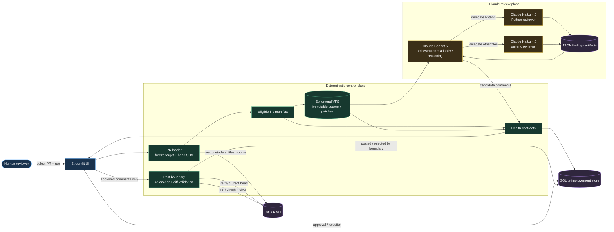
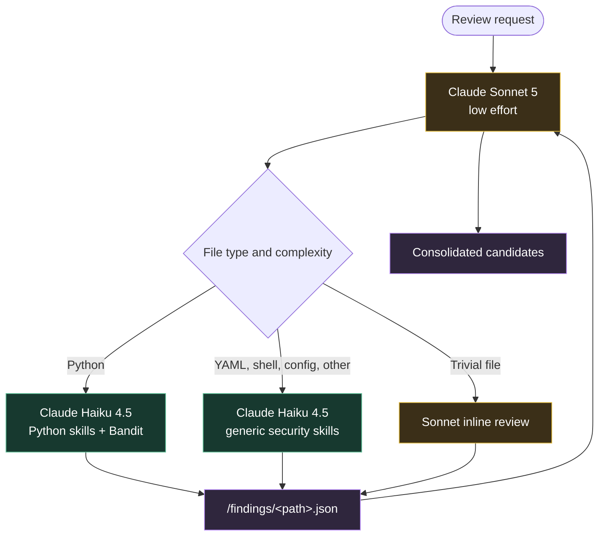
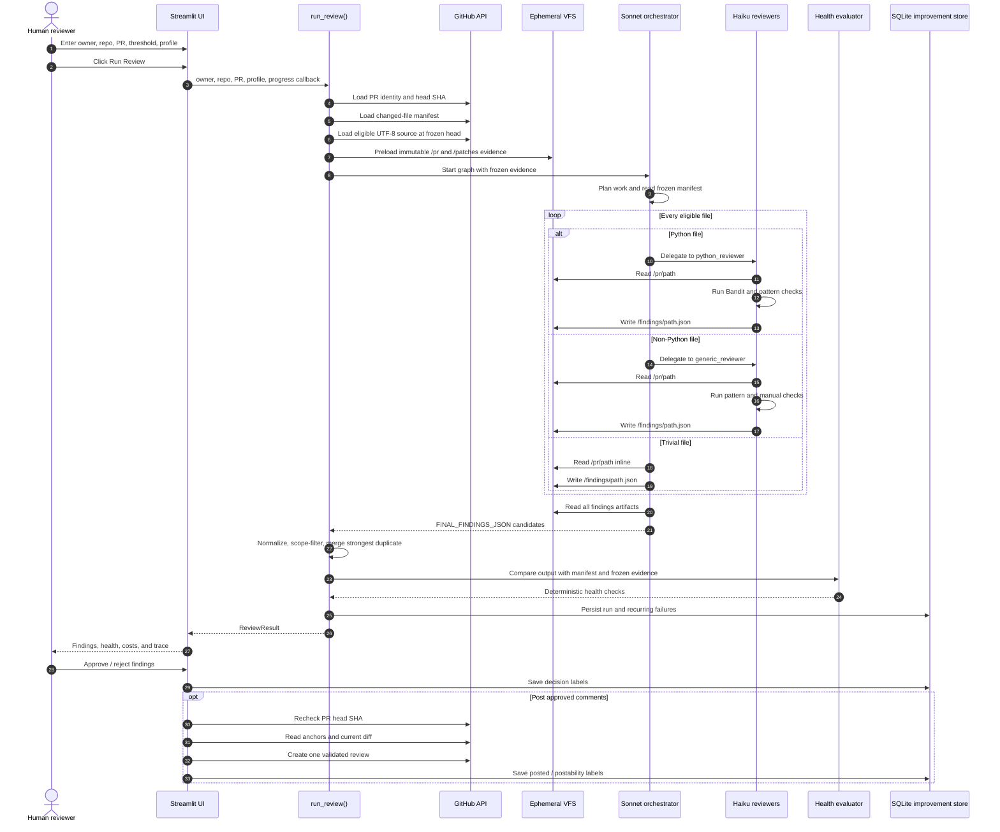
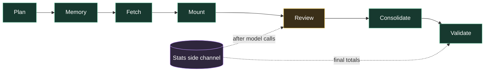
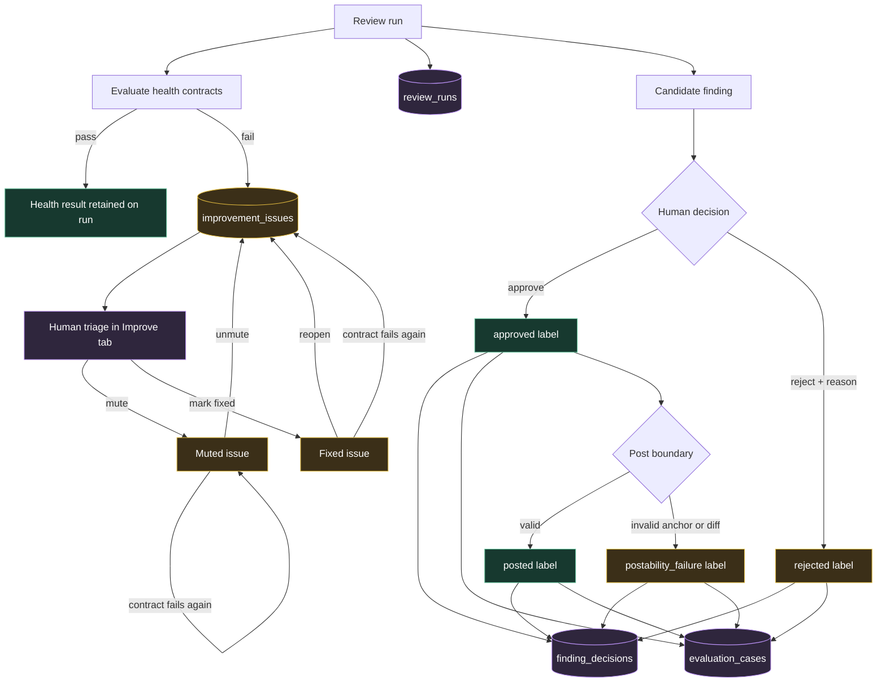
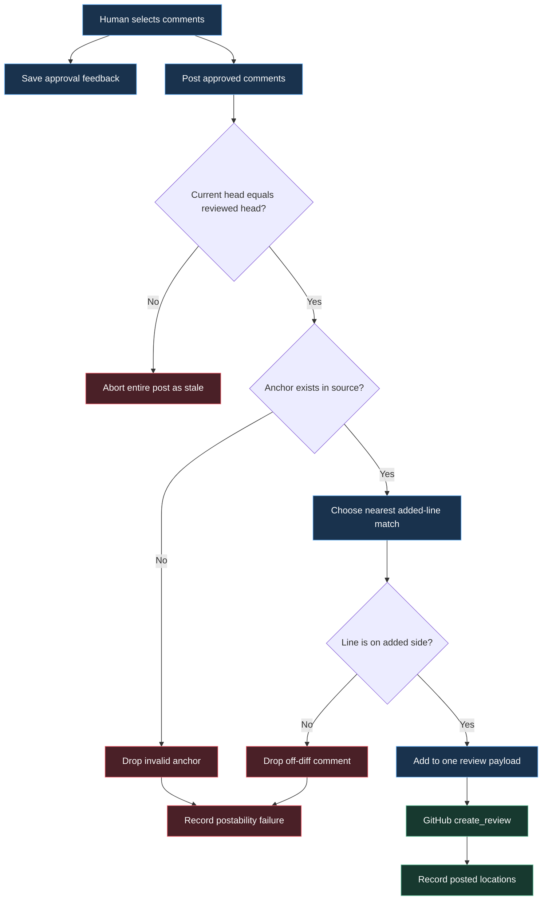

# Quorum Operations and Event Guide

This guide explains how a pull-request review moves through Quorum, which
events appear in the Streamlit UI, where Claude models are used, which
boundaries are deterministic, and how human decisions become improvement
signals.

For implementation-level component notes, see
[ARCHITECTURE.md](../ARCHITECTURE.md). For installation and basic usage, see
[README.md](../README.md).

## System at a glance



The separation is intentional. Claude decides how to inspect and delegate a
review, but it cannot change the selected repository, mutate reviewed source,
write persistent memory, or post to GitHub.

## Current model routing

The local deployment is configured with `MODEL_PROVIDER=anthropic` and
`REVIEW_COST_PROFILE=economy`.



Sonnet uses adaptive thinking because orchestration is a multi-step tool-use
problem. Haiku reviewers do not receive adaptive-thinking parameters: Haiku
4.5 does not support adaptive or interleaved thinking, and a fixed manual
thinking budget would increase review cost on every call. The deterministic
budget middleware still limits the complete run to the configured dollar and
call ceilings.

## End-to-end review sequence



### Short-circuit branches

- If no eligible files remain after filtering, Quorum returns without an LLM
  call and records a zero-cost run.
- If the PR head changes while the manifest is being frozen, the run stops and
  asks for a new review.
- If a budget or call ceiling interrupts the graph, Quorum recovers the latest
  checkpoint and marks the output incomplete.
- If the reviewed head changes before posting, all approvals from the stale
  diff are rejected.
- If an anchor is absent or does not land on an added diff line, that comment
  is not posted.

## Live event flow

The UI receives progress through the `on_event` callback. Log events use this
shape:

```json
{
  "type": "log",
  "phase": "review",
  "icon": "🤖",
  "text": "Delegating to python_reviewer",
  "detail": "Review /pr/src/app.py"
}
```

Cost updates use `type: "stats"` and contain the current call count, cost,
token totals, cache share, and per-model rollup.



### Event catalog

| Phase | Event | Source | Meaning |
| --- | --- | --- | --- |
| Plan | `Starting review of owner/repo#PR` | `run_review` | A unique run ID and selected profile are active. |
| Plan | `Planning the run` | Sonnet `write_todos` call | The orchestrator decomposed the review. |
| Memory | `Loaded trusted historical counters` | `FileBackedStore` | Only integer run/post counters are supplied; the model cannot mutate them. |
| Fetch | `Froze pull-request target and manifest` | Trusted loader | Repository, PR number, head SHA, eligible paths, and skipped paths are fixed. |
| Fetch | `Reading frozen PR metadata` | Bound `fetch_pr` tool | Sonnet is reading untrusted title/body data for context. |
| Fetch | `Reading frozen manifest` | Bound `list_files` tool | The model sees only files selected by trusted Python. |
| Fetch | `Reading frozen file` | Bound `get_file_content` tool | Content comes from the frozen in-memory copy, not a new arbitrary GitHub read. |
| Mount | `Preloaded immutable review evidence` | `run_review` | `/pr/` source and `/patches/` diffs are present before the graph starts. |
| Review | `Delegating to …` | Sonnet `task` call | A specialist subagent receives one exact VFS/repository path. |
| Review | `Running scanner` | Haiku `run_command` call | Validated Bandit arguments run in a temporary directory without a shell. |
| Review | `Pattern scan` | Reviewer `regex_search` call | A bounded, timeout-protected regex scan is running. |
| Review | `Reviewer wrote its result` | Reviewer `write_file` call | A JSON findings artifact, including an empty result, was written. |
| Consolidate | `Reading findings back` | Sonnet filesystem call | Per-file artifacts are being assembled. |
| Consolidate | `Consolidated candidate findings` | Deterministic parser | Low severity, malformed, duplicate, and out-of-scope items are accounted for. |
| Validate | `Evaluated deterministic health contract` | Health evaluator | Coverage, integrity, anchors, artifact validity, completion, and budgets were checked. |
| Any model phase | `stats` update | Cost middleware | Calls, tokens, cache usage, and cost meters refresh. |

The progress feed is observational. It does not grant new capabilities; trust
boundaries are enforced in tool schemas, backends, and deterministic Python.

## Health contracts

The **Improve** tab shows the checks from the current run and recurring
failures for the repository.

| Contract | Detects |
| --- | --- |
| `frozen_source_mount` | An eligible frozen source file was absent from the VFS. |
| `vfs_path_identity` | Source appeared outside the frozen manifest. |
| `source_content_integrity` | Mounted source differs from the trusted frozen copy. |
| `eligible_file_coverage` | An eligible file has no per-file review artifact. |
| `finding_artifact_scope` | A findings artifact belongs to an unknown file. |
| `finding_artifact_validity` | An artifact is malformed or lacks a JSON comments list. |
| `source_truncation` | A file exceeded the configured review size limit. |
| `finding_path_scope` | A candidate comment refers to an ineligible path. |
| `finding_anchor_exists` | The claimed anchor does not exist at the reviewed head. |
| `finding_line_in_file` | A claimed line is outside the file. |
| `finding_anchor_at_claimed_line` | The anchor exists elsewhere and requires re-anchoring. |
| `run_budget` | Cost/call ceilings were exceeded or halted the run. |
| `run_completed` | The graph ended with an error. |

## Supervised improvement loop



The loop is supervised. It gathers failure evidence and human labels, but does
not edit prompts, modify code, create branches, or open pull requests.

### Issue status lifecycle

An issue is fingerprinted by repository and invariant, so the same contract
failing on a later run updates one row rather than creating a second.

| Situation | Effect |
| --- | --- |
| Contract fails on a new run | Occurrence count increments; a `fixed` issue reopens. |
| Contract fails again while muted | Occurrence count increments; the issue stays muted and out of the Open list. |
| The same run is persisted twice | Nothing inflates and no status changes -- but a contract failing for the first time is still recorded. |
| Human mutes, marks fixed, unmutes, or reopens | Status changes only; evidence and counts are preserved. |

Every transition is reversible and the **Improve** tab filters by status, so
muting an invariant hides it from the Open list without putting it out of
reach. Mark an issue fixed only after the contract passes on a fresh run --
the count is the evidence that it was real.

### Improvement database contents

Stored:

- run ID, repository, PR number, head SHA, selected profile;
- expected/reviewed file counts, call count, cost, and health checks;
- finding path, line, severity, category, confidence, and anchor hash;
- approved, rejected, posted, and postability-failure labels;
- deduplicated issue fingerprints, status, count, and path-level evidence.

Not stored:

- source code or patches;
- PR title or description;
- finding body, suggested fix, or raw anchor text;
- model-provider error messages that could echo reviewed input;
- API keys or GitHub tokens.

## Posting flow



## UI screenshots

Captured from a live run against the public sandbox pull request
`chatkausik/Evidensia.AI#7` at a 1600x1000 viewport, Economy profile, Anthropic
provider. The Streamlit developer toolbar is hidden in these captures; nothing
else is edited. `ui-empty.png` in the repository root is a historical capture
that predates the **Improve** tab -- treat it as a layout relic, not as
evidence of the current runtime.

### Empty state

The provider chip, cost profile, model routing, ceilings, and tracing status are
all readable before a run starts. Confirm these match your intent first.


### Active review

The phase strip advances Plan -> Memory -> Fetch -> Mount -> Review ->
Consolidate -> Validate. Meters update per model call, so a run that is going to
breach the ceiling is visible long before it does.


### Completed review

Stat tiles carry the reviewed head SHA, the severity bar shows the mix, and each
finding is one row: severity dot, description, `file:line`, and confidence. Rows
at or above the threshold arrive pre-selected.


### Finding detail

Clicking a row opens the evidence rather than expanding prose in place: the
offending line highlighted in its surrounding context, why it matters, and a
colour-coded suggested fix.


### Improve tab -- health contract

Thirteen deterministic checks run against trusted state, never against model
claims. Read this before treating a low finding count as a clean result.


### Improve tab -- recurring issues

Failed contracts become fingerprinted issues with an occurrence count, last-seen
run, and evidence. In the capture below, `finding_anchor_exists` and
`finding_anchor_at_claimed_line` failed on a run whose findings were otherwise
sound -- the health contract caught anchors the posting step would have had to
drop.


### Improve tab -- closed issues stay reachable

Issues are filtered by status, and every transition is reversible. The two
issues below were marked fixed after an earlier rate-limited run; they remain
inspectable and can be reopened.


### Not captured

`docs/images/quorum-post-result.png` (posted count, review URL, re-anchored
comments, validation drops) is missing on purpose: producing it means submitting
a real review to a real pull request. Capture it during a genuine posting run
rather than manufacturing one for documentation.

### Capture rules

Do not capture `.env`, browser developer tools, request headers, API keys, or
private repository source. Use a public test PR or a synthetic repository when
creating documentation screenshots.

## Operator checklist

Before a review:

1. Confirm the UI shows `anthropic` and the intended cost profile.
2. Verify the PR head is stable and the GitHub token can read it.
3. Confirm the cost and call ceilings in the sidebar.
4. Decide whether documentation files should be included.

After a review:

1. Check the **Improve** tab before treating zero findings as a clean result.
2. Inspect any failed coverage, artifact, anchor, budget, or completion check.
3. Review low-confidence findings individually.
4. Save approval feedback even when all findings are rejected.
5. Post only after confirming the reviewed head SHA in the summary.
6. Follow the GitHub review link and verify the rendered comment placement.

For recurring failures:

1. Open the issue evidence in the **Improve** tab.
2. Reproduce with the same PR shape when possible.
3. Add or update a deterministic test before changing prompts or agent logic.
4. Mark the issue fixed only after the health contract passes on a new run.
5. Mute only expected exceptions; a recurrence of a fixed issue reopens it.
