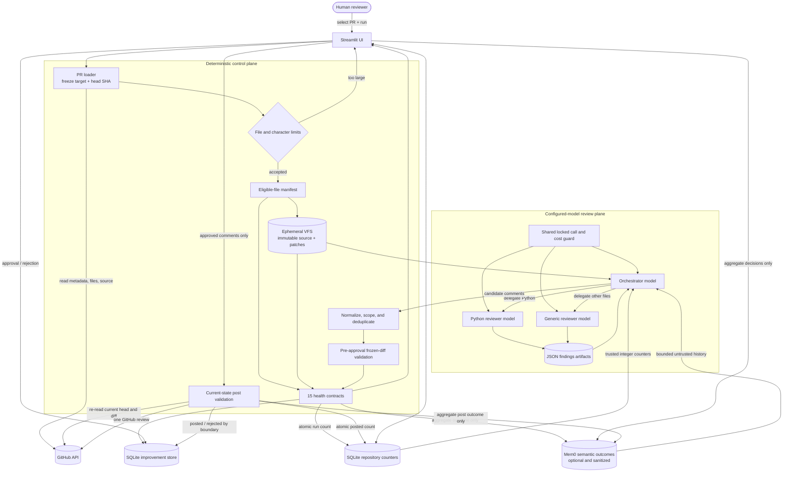
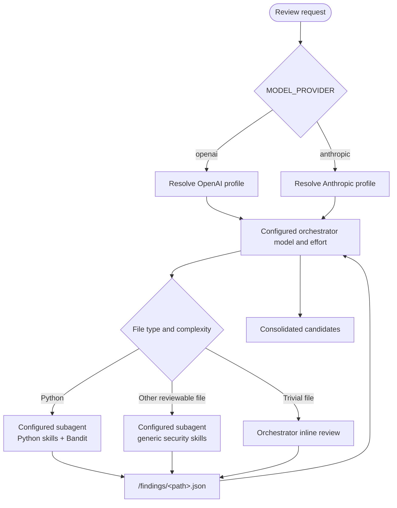
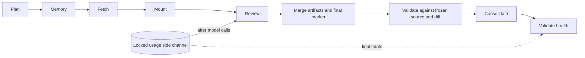
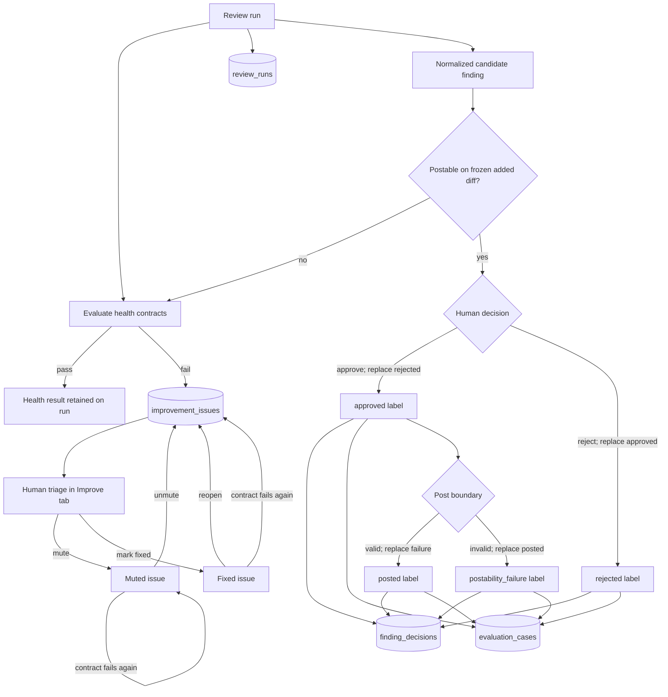
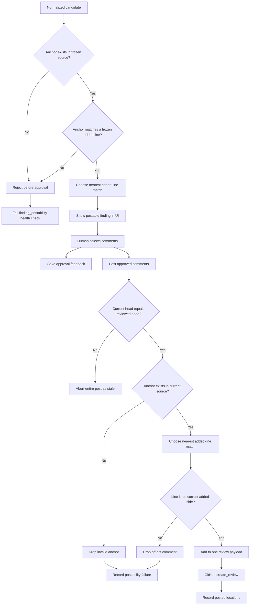
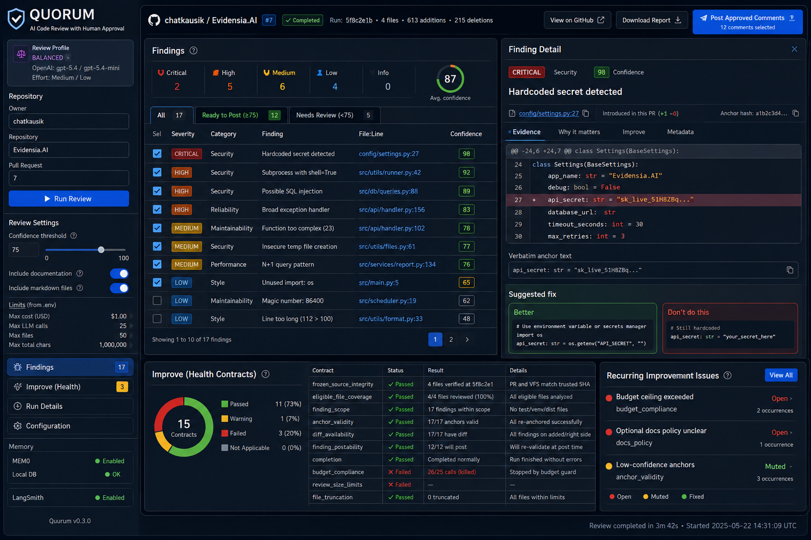
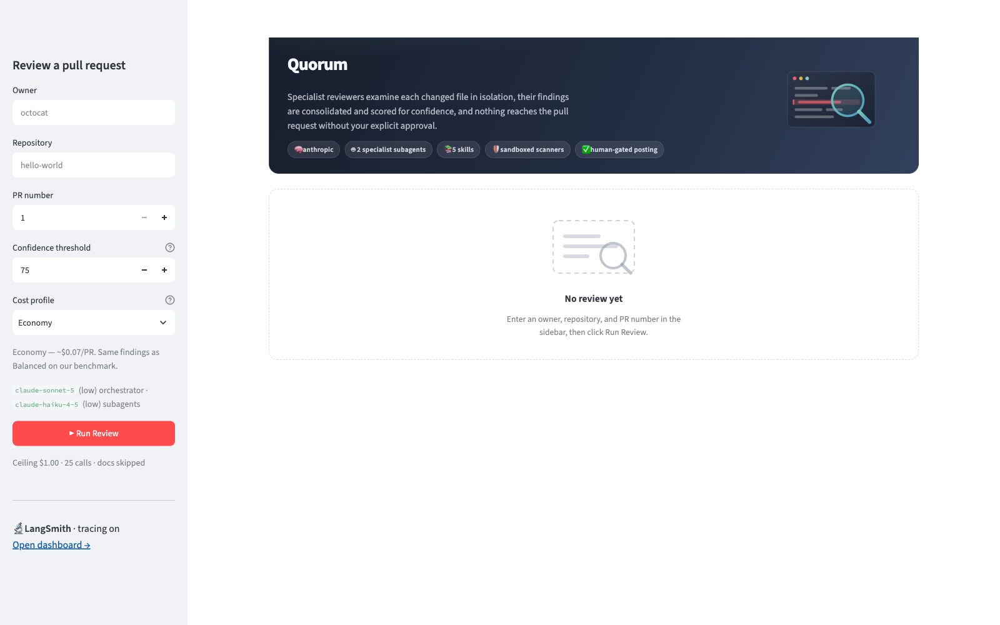
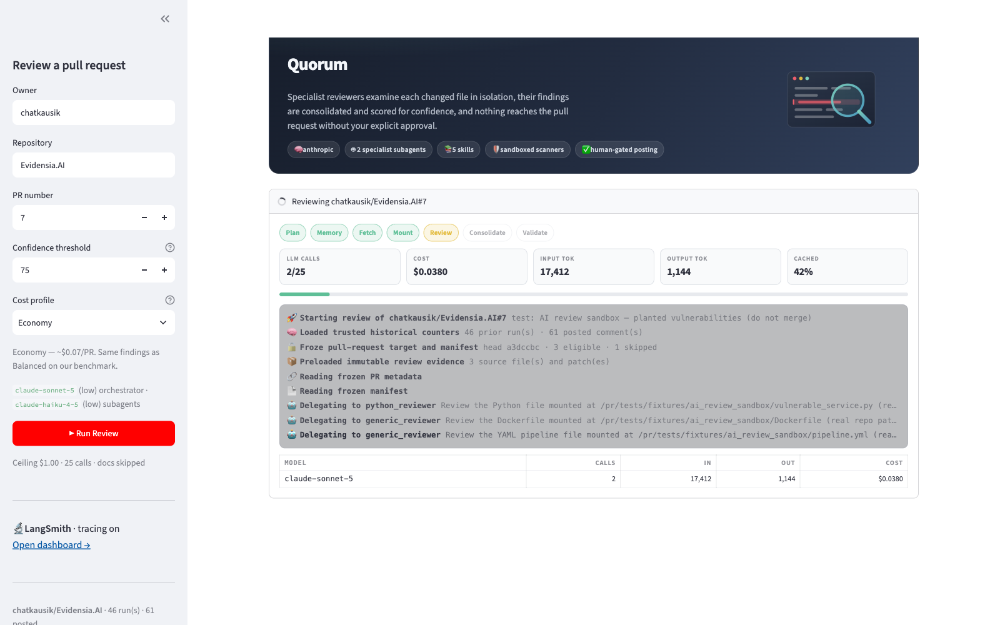
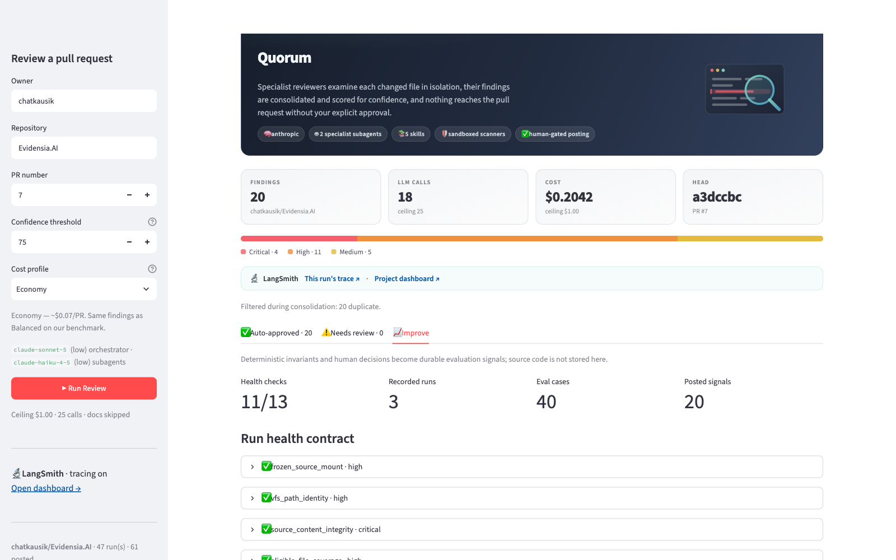
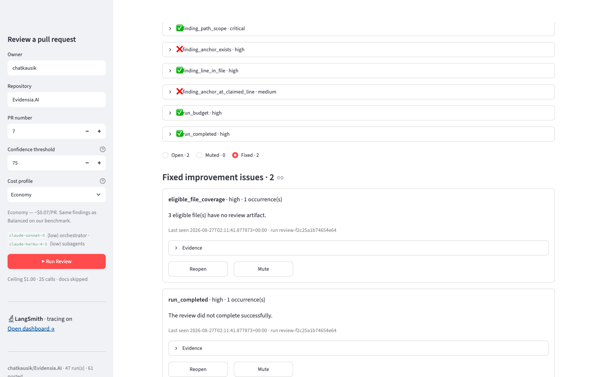

# Quorum Operations and Event Guide

This guide explains how a pull-request review moves through Quorum, which
events appear in the Streamlit UI, where configured models are used, which
boundaries are deterministic, and how human decisions become improvement
signals.

For implementation-level component notes, see
[ARCHITECTURE.md](../ARCHITECTURE.md). For installation and basic usage, see
[README.md](../README.md).

## System at a glance


Use this visual for orientation and the Mermaid flow below for exact operational
relationships and failure paths. The image is generated from the checked-in
[`diagrams/quorum-system-overview.mmd`](diagrams/quorum-system-overview.mmd)
source; see the [diagram README](diagrams/README.md) for regeneration and
visual-verification instructions.



The separation is intentional. The configured model decides how to inspect and
delegate a review, but it cannot change the selected repository, mutate
reviewed source, write persistent memory, or post to GitHub. Trusted Python
alone reads and writes the optional semantic layer.

## Provider and profile routing

`MODEL_PROVIDER` selects the provider and `REVIEW_COST_PROFILE` selects one
validated mapping. Explicit model/effort overrides are accepted only when they
are non-empty and within the supported effort set.



OpenAI models use the Responses API with the configured reasoning effort.
Anthropic Sonnet/Opus models use adaptive thinking plus the configured effort;
Haiku 4.5 omits unsupported thinking controls. One budget middleware instance
still covers the complete agent tree regardless of provider or profile.

### Admission and budget controls

| Control | Enforcement point | Behavior |
| --- | --- | --- |
| Provider/profile/effort | Configuration load and per-run settings resolution | Unknown or empty values fail closed; no provider fallback. |
| Boolean and numeric settings | Configuration load and per-run settings resolution | Malformed booleans and out-of-range confidence, output, cost, call, file, or character limits raise `ConfigurationError`. |
| Eligible files | Trusted loader, before agent creation | More than `REVIEW_MAX_FILES` refuses the whole run. |
| Aggregate source | Trusted loader, before agent creation | More than `REVIEW_MAX_TOTAL_CHARS` refuses the whole run. |
| Individual source | Trusted loader | Content after 100,000 characters is marked truncated and fails run health. |
| LLM calls | Locked `before_model` hook | Calls are reserved before provider access; request `max + 1` never starts. |
| Dollar cost | Locked `after_model` hook | Token/cache usage is priced after each response; crossing the threshold halts subsequent work. |

The call count is a hard ceiling. The dollar value is a stop threshold because
providers do not expose the exact billable token count before returning a
response. UI meters show the shared totals and per-model rollups from the same
locked middleware used for enforcement.

## End-to-end review sequence

```mermaid
sequenceDiagram
    autonumber
    actor Human as Human reviewer
    participant UI as Streamlit UI
    participant Run as run_review()
    participant GH as GitHub API
    participant VFS as Ephemeral VFS
    participant A as Agent tree
    participant Budget as Shared budget guard
    participant Valid as Frozen-candidate validator
    participant Health as Health evaluator
    participant DB as SQLite improvement store
    participant Stats as SQLite repository counters
    participant Mem0 as Mem0 semantic memory

    Human->>UI: Enter owner, repo, PR, threshold, profile
    Human->>UI: Click Run Review
    UI->>Run: owner, repo, PR, profile, progress callback
    Run->>GH: Load PR identity and head SHA
    Run->>GH: Load changed-file manifest
    loop Eligible files
        Run->>GH: Load UTF-8 source at frozen head
        Run->>Run: Enforce file and aggregate-size limits
    end
    Run->>Stats: Load trusted integer counters
    Run->>Mem0: Search fixed query under opaque repository scope
    Mem0-->>Run: Bounded untrusted aggregate outcome history
    Run->>VFS: Preload immutable /pr and /patches evidence
    Run->>A: Start graph with frozen evidence

    A->>A: Plan work and read frozen manifest
    loop Every eligible file
        alt Python file
            A->>A: Delegate to python_reviewer
            A->>Budget: Reserve each provider call
            Budget-->>A: Allowed or exact call-limit stop
            A->>VFS: Read /pr/path; run Bandit and pattern checks
            A->>VFS: Write /findings/path.json
        else Non-Python file
            A->>A: Delegate to generic_reviewer
            A->>Budget: Reserve each provider call
            Budget-->>A: Allowed or exact call-limit stop
            A->>VFS: Read /pr/path; run pattern checks
            A->>VFS: Write /findings/path.json
        else Trivial file
            A->>Budget: Reserve provider call
            A->>VFS: Read and review /pr/path inline
            A->>VFS: Write /findings/path.json
        end
    end

    A->>VFS: Read all findings artifacts
    A-->>Run: FINAL_FINDINGS_JSON candidates
    Run->>Run: Normalize, scope-filter, merge strongest duplicate
    Run->>Valid: Re-anchor against frozen source and added diff
    Valid-->>Run: Retained candidates, moves, and rejection evidence
    Run->>Health: Compare state and validation with frozen evidence
    Health-->>Run: 15 deterministic checks
    Run->>DB: Persist run and recurring failures
    Run->>Mem0: Add sanitized aggregate review outcome
    Run->>Stats: Atomic run-counter increment
    Run-->>UI: ReviewResult
    UI-->>Human: Findings, health, costs, and trace

    Human->>UI: Approve / reject findings
    UI->>DB: Save decision labels
    UI->>Mem0: Add sanitized aggregate decision outcome
    opt Post approved comments
        UI->>GH: Recheck head SHA, source, and current diff
        UI->>GH: Create one validated review
        UI->>DB: Save posted / postability labels
        UI->>Mem0: Add sanitized aggregate posting outcome
        UI->>Stats: Atomic posted-comment increment
    end
```

### Short-circuit branches

- If no eligible files remain after filtering, Quorum returns without an LLM
  call and records a zero-cost run.
- If the PR head changes while the manifest is being frozen, the run stops and
  asks for a new review.
- If eligible files or aggregate source exceed configured limits, Quorum refuses
  the run before model execution; it never silently reviews only a prefix.
- If a cost stop threshold or call ceiling interrupts the graph, Quorum
  recovers the latest checkpoint and marks the output incomplete. The call
  ceiling is checked before requests; cost is checked after responses.
- If a candidate lacks an anchor or cannot land on the frozen added-side diff,
  it is removed before the approval UI and recorded by `finding_postability`.
- If frozen patch evidence is missing, `diff_availability` fails even when the
  remaining run completes.
- If the reviewed head changes before posting, all approvals from the stale
  diff are rejected.
- If an anchor is absent or does not land on an added diff line, that comment
  is independently rejected again at posting time.
- If Mem0 is disabled, unavailable, slow, or rejects a credential, the same
  operation continues with local SQLite history only.

## Live event flow

The UI receives progress through the `on_event` callback. Log events use this
shape:

```json
{
  "type": "log",
  "phase": "review",
  "icon": "🤖",
  "text": "Delegating to python_reviewer",
  "detail": "Review /pr/src/app.py"
}
```

Cost updates use `type: "stats"` and contain the current call count, cost,
token totals, cache share, and per-model rollup.



### Event catalog

| Phase | Event | Source | Meaning |
| --- | --- | --- | --- |
| Plan | `Starting review of owner/repo#PR` | `run_review` | A unique run ID and selected profile are active. |
| Plan | `Planning the run` | Orchestrator `write_todos` call | The orchestrator decomposed the review. |
| Memory | `Loaded long-term review memory` | `FileBackedStore` + optional Mem0 adapter | Trusted integer counters and a bounded count of untrusted, sanitized semantic memories are supplied; the model cannot mutate either store. |
| Fetch | `Froze pull-request target and manifest` | Trusted loader | Repository, PR number, head SHA, eligible paths, and skipped paths are fixed. |
| Fetch | `Reading frozen PR metadata` | Bound `fetch_pr` tool | The orchestrator is reading untrusted title/body data for context. |
| Fetch | `Reading frozen manifest` | Bound `list_files` tool | The model sees only files selected by trusted Python. |
| Fetch | `Reading frozen file` | Bound `get_file_content` tool | Content comes from the frozen in-memory copy, not a new arbitrary GitHub read. |
| Mount | `Preloaded immutable review evidence` | `run_review` | `/pr/` source and `/patches/` diffs are present before the graph starts. |
| Review | `Delegating to …` | Orchestrator `task` call | A specialist subagent receives one exact VFS/repository path. |
| Review | `Running scanner` | Reviewer `run_command` call | Validated Bandit arguments run in a temporary directory without a shell. |
| Review | `Pattern scan` | Reviewer `regex_search` call | A bounded regex scans one safe `/pr/` path from the frozen backend. |
| Review | `Reviewer wrote its result` | Reviewer `write_file` call | A JSON findings artifact, including an empty result, was written. |
| Consolidate | `Reading findings back` | Orchestrator filesystem call | Per-file artifacts are being assembled. |
| Consolidate | `Consolidated candidate findings` | Deterministic parser and frozen validator | Low severity, malformed, duplicate, out-of-scope, invalid-anchor, and off-diff items are accounted for; valid moves are re-anchored. |
| Validate | `Evaluated deterministic health contract` | Health evaluator | Fifteen coverage, integrity, patch, anchor, postability, completion, and budget checks were evaluated. |
| Any model phase | `stats` update | Cost middleware | Calls, tokens, cache usage, and cost meters refresh. |

The progress feed is observational. It does not grant new capabilities; trust
boundaries are enforced in tool schemas, backends, and deterministic Python.
Target lookup, source loading, and size enforcement happen before the first
progress event; failure there is shown directly by the Streamlit status panel.

## Health contracts

The **Improve** tab shows the checks from the current run and recurring
failures for the repository.

| Contract | Detects |
| --- | --- |
| `frozen_source_mount` | An eligible frozen source file was absent from the VFS. |
| `vfs_path_identity` | Source appeared outside the frozen manifest. |
| `source_content_integrity` | Mounted source differs from the trusted frozen copy. |
| `eligible_file_coverage` | An eligible file has no per-file review artifact. |
| `finding_artifact_scope` | A findings artifact belongs to an unknown file. |
| `finding_artifact_validity` | An artifact is malformed or lacks a JSON comments list. |
| `source_truncation` | A file exceeded the configured review size limit. |
| `diff_availability` | GitHub omitted or failed to provide patch evidence for an eligible file. |
| `finding_path_scope` | A candidate comment refers to an ineligible path. |
| `finding_anchor_exists` | The claimed anchor does not exist at the reviewed head. |
| `finding_line_in_file` | A claimed line is outside the file. |
| `finding_anchor_at_claimed_line` | The anchor exists elsewhere and requires re-anchoring. |
| `finding_postability` | A candidate was rejected before approval because its anchor was missing or off the added-side diff. |
| `run_budget` | Cost/call ceilings were exceeded or halted the run. |
| `run_completed` | The graph ended with an error. |

## Supervised improvement loop



The loop is supervised. It gathers failure evidence and human labels, but does
not edit prompts, modify code, create branches, or open pull requests.
Human disposition and posting outcome are independent dimensions. Opposite
labels are replaced within a dimension, preventing contradictory training
examples without erasing the other dimension.

### Issue status lifecycle

An issue is fingerprinted by repository and invariant, so the same contract
failing on a later run updates one row rather than creating a second.

| Situation | Effect |
| --- | --- |
| Contract fails on a new run | Occurrence count increments; a `fixed` issue reopens. |
| Contract fails again while muted | Occurrence count increments; the issue stays muted and out of the Open list. |
| The same run is persisted twice | Nothing inflates and no status changes -- but a contract failing for the first time is still recorded. |
| Human mutes, marks fixed, unmutes, or reopens | Status changes only; evidence and counts are preserved. |

Every transition is reversible and the **Improve** tab filters by status, so
muting an invariant hides it from the Open list without putting it out of
reach. Mark an issue fixed only after the contract passes on a fresh run --
the count is the evidence that it was real.

### Improvement database contents

Stored:

- run ID, repository, PR number, head SHA, selected profile;
- expected/reviewed file counts, call count, cost, and health checks;
- finding path, line, severity, category, confidence, and anchor hash;
- approved, rejected, posted, and postability-failure labels;
- deduplicated issue fingerprints, status, count, and path-level evidence.

Not stored:

- source code or patches;
- PR title or description;
- finding body, suggested fix, or raw anchor text;
- model-provider error messages that could echo reviewed input;
- API keys or GitHub tokens.

### Hosted semantic-memory contents

When `MEM0_API_KEY` is present (or `MEM0_ENABLED=true` with a key), Mem0 stores
only fixed-schema aggregate summaries. The entity key is a SHA-256-derived
opaque repository identifier, and `MEM0_APP_ID` isolates Quorum data from other
applications.

Sent to Mem0:

- file, finding, approval, rejection, posting, and validation-failure counts;
- finding category/severity and confidence-band mixes;
- validated health-contract names, completion/budget flags, and cost profile;
- a small allowlist of generic rejection reasons.

Never sent to Mem0:

- owner or repository names, PR number/title/body, commit SHAs, or author;
- source, patches, paths, line numbers, anchors, finding title/body, or fixes;
- review URLs, posted locations, provider errors, or credentials.

Retrieved text is capped by `MEM0_TOP_K` and `MEM0_MAX_CONTEXT_CHARS`, deduped,
and inserted into the review task as untrusted informational outcome data. The
query is fixed and contains no PR data. Mem0 failures log only the exception
class and never block review, feedback saving, or posting.

## Approval and posting flow



The first validation pass protects reviewer attention and supplies health
evidence. The second protects GitHub from stale approvals and remote changes.
Only the second pass can create a review or produce `posted`/
`postability_failure` outcome labels.

## Concurrent sessions and deployment

Each review owns an isolated graph, checkpoint, VFS, and budget middleware.
Multiple Streamlit sessions can run concurrently without sharing agent state.
Repository counters use an atomic SQLite `BEGIN IMMEDIATE` increment with WAL
mode and a 30-second busy timeout, preventing the lost-update behavior of the
legacy JSON store. The legacy records are imported once when the new database
is empty.

The improvement database is separate and persists run health, recurring issue
fingerprints, feedback, and sanitized evaluation cases. If a reviewer changes a
decision, the old opposite label is deleted before the new label is inserted.
Posting outcomes follow the same replacement rule.

The optional Mem0 adapter is created once per Streamlit session and shared by
that session's reviews and feedback actions. It can be shared across hosts via
one `MEM0_APP_ID`, while local SQLite remains the source of truth. Identical
same-session events are not resent; hosted cross-process deduplication and
semantic consolidation are Mem0 responsibilities.

Run from a checkout after editable installation:

```bash
.venv/bin/quorum-review
```

The same command is installed by the wheel. It finds packaged `app.py` and
skills under `share/quorum`, so the working directory does not need to be the
repository. `QUORUM_SKILLS_DIR` is reserved for deliberate custom skill
installations.

For deployment, keep all Streamlit instances that share SQLite on one durable
writer volume. For multi-host horizontal scaling, replace `FileBackedStore` and
`ImprovementStore` with adapters for a managed transactional database. Do not
place independent SQLite files on each host: counters, issue status, and
feedback would diverge. Configure the same Mem0 credentials and `MEM0_APP_ID`
on every host that should share semantic history; disable it with
`MEM0_ENABLED=false` for local-only or restricted deployments.

### Restart after configuration changes

Streamlit hot reload refreshes the app script but may retain already-imported
Python modules. After changing `.env`, adding configuration exports, or
installing/upgrading dependencies, stop the existing process with Ctrl-C and
start it again:

```bash
.venv/bin/quorum-review
```

An error such as `cannot import name 'MEM0_API_KEY' from quorum.config` after a
code update indicates a stale process, not a missing key. Confirm a fresh
interpreter first, then restart the UI:

```bash
.venv/bin/python -c "from quorum.config import MEM0_API_KEY; print('config import ok')"
```

If the port is unexpectedly occupied, identify the exact listener with
`lsof -nP -iTCP:8502 -sTCP:LISTEN` before stopping anything; do not terminate an
unrelated application that happens to use the same port.

The CI workflow validates Python 3.11–3.13, Ruff, branch-aware coverage,
offline finding evaluation, wheel/sdist construction, installed resource
discovery, and dependency vulnerabilities. See the
[architecture quality-gate flow](../ARCHITECTURE.md#packaging-and-quality-gates)
and [evaluation guide](../evals/README.md).

## UI screenshots

### Composite product view



The composite is an illustrative overview with redacted example values. It
shows how findings, evidence, approval, health, recurring issues, and memory
status fit together; use the focused captures below as evidence of the running
implementation.

The following screenshots were captured from a live run against the public
sandbox pull request `chatkausik/Evidensia.AI#7` at a 1600x1000 viewport,
Economy profile, Anthropic provider. The Streamlit developer toolbar is hidden
in these captures; nothing else is edited. The Improve captures predate the
addition of `diff_availability` and `finding_postability`, so their visible
totals show 13 rather than the current 15 checks. They document layout and issue
interaction, not the current contract count. `ui-empty.png` in the repository
root is an older layout relic that predates the **Improve** tab.

### Empty state

The provider chip, cost profile, model routing, ceilings, tracing status, and
Mem0 status are all readable before a run starts. Confirm these match your
intent first.



### Active review

The phase strip advances Plan -> Memory -> Fetch -> Mount -> Review ->
Consolidate -> Validate. Meters update per model call, so a run that is going to
breach the ceiling is visible long before it does.



### Completed review

Stat tiles carry the reviewed head SHA, the severity bar shows the mix, and each
finding is one row: severity dot, description, `file:line`, and confidence. Rows
at or above the threshold arrive pre-selected.


### Finding detail

Clicking a row opens the evidence rather than expanding prose in place: the
offending line highlighted in its surrounding context, why it matters, and a
colour-coded suggested fix.


### Improve tab -- health contract

Fifteen deterministic checks run against trusted state, never against model
claims. Read this before treating a low finding count as a clean result. The
historical capture below shows the earlier 13-check version as noted above.



### Improve tab -- recurring issues

Failed contracts become fingerprinted issues with an occurrence count, last-seen
run, and evidence. In the capture below, `finding_anchor_exists` and
`finding_anchor_at_claimed_line` failed on a run whose findings were otherwise
sound -- the health contract caught anchors the posting step would have had to
drop.


### Improve tab -- closed issues stay reachable

Issues are filtered by status, and every transition is reversible. The two
issues below were marked fixed after an earlier rate-limited run; they remain
inspectable and can be reopened.



### Not captured

`docs/images/quorum-post-result.png` (posted count, review URL, re-anchored
comments, validation drops) is missing on purpose: producing it means submitting
a real review to a real pull request. Capture it during a genuine posting run
rather than manufacturing one for documentation.

### Capture rules

Do not capture `.env`, browser developer tools, request headers, API keys, or
private repository source. Use a public test PR or a synthetic repository when
creating documentation screenshots.

## Operator checklist

Before a review:

1. Confirm the UI shows the intended provider, cost profile, and model routing.
2. Verify the PR head is stable and the GitHub token can read it.
3. Confirm the cost and call ceilings in the sidebar.
4. Confirm file/aggregate limits are suitable for the PR or plan to split it.
5. Decide whether documentation files should be included.
6. If Mem0 is enabled, confirm the deployment's hosted-data policy permits the
   sanitized aggregate fields listed above.

After a review:

1. Check the **Improve** tab before treating zero findings as a clean result.
2. Inspect any failed coverage, diff, artifact, anchor, postability, budget, or
   completion check.
3. Review low-confidence findings individually.
4. Save approval feedback even when all findings are rejected.
5. Post only after confirming the reviewed head SHA in the summary.
6. Follow the GitHub review link and verify the rendered comment placement.

For recurring failures:

1. Open the issue evidence in the **Improve** tab.
2. Reproduce with the same PR shape when possible.
3. Add or update a deterministic test before changing prompts or agent logic.
4. Mark the issue fixed only after the health contract passes on a new run.
5. Mute only expected exceptions; a recurrence of a fixed issue reopens it.

Before a release:

1. Upgrade the audited build toolchain with
   `.venv/bin/python -m pip install --upgrade "setuptools>=83"`.
2. Run Ruff, the coverage-enabled test suite, and the offline evaluation gates.
3. Build both wheel and source distribution.
4. Install the wheel outside the checkout and verify `quorum-review` can find
   `app.py` and all five skills.
5. Run `pip-audit` with current advisory data.
6. Review configuration, tracing retention, shared-volume, and database plans
   for the deployment environment, including Mem0 data retention and access.
