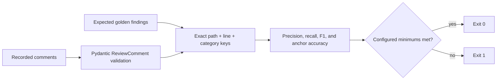

# Quorum evaluations

`quorum-eval` is an offline regression harness for recorded code-review
findings. It does not call GitHub, a model provider, or LangSmith.



## Run it

```bash
quorum-eval evals/fixtures/expected.json evals/fixtures/actual.json \
  --min-precision 1 --min-recall 1 --min-f1 1 --min-anchor-accuracy 1
```

The command prints a JSON score object. Every minimum is optional and defaults
to zero; CI sets all four to `1` for the checked-in smoke fixture.

## File formats

Expected findings may be a top-level list or an object with an `expected` list.
Each entry requires the exact identity fields and can include an anchor:

```json
{
  "expected": [
    {
      "path": "src/service.py",
      "line": 24,
      "category": "correctness",
      "anchor_text": "result = blocking_call()"
    }
  ]
}
```

Actual findings may be a top-level list or an object with a `comments` list.
Every entry must validate as a complete `ReviewComment` with `path`, positive
`line`, `severity`, `category`, `confidence`, non-empty `anchor_text`, and
`body`; `title` and `suggestion` are optional.

## Scoring contract

- Identity is the exact tuple `(path, line, category)`. Severity, confidence,
  title, body, and suggestion do not affect true-positive identity.
- Precision is `TP / (TP + FP)` and recall is `TP / (TP + FN)`.
- F1 is the harmonic mean of precision and recall.
- Anchor accuracy is evaluated only for true-positive identities whose expected
  entry includes `anchor_text`. Whitespace at both ends is ignored; the
  remaining text must match exactly.
- Duplicate identities within either file collapse to one set member. Golden
  fixtures should avoid duplicates so accidental overwrite cannot hide a case.
- An empty denominator scores `1.0`, including an all-empty expected/actual
  fixture. Do not use an empty fixture as evidence of review quality.

## Adding meaningful cases

The checked-in pair under `evals/fixtures/` is a synthetic smoke test for the
harness and CI wiring. It is not a production-quality benchmark.

For each new case:

1. Start from a public, synthetic, or explicitly sanitized PR snapshot.
2. Have a human reviewer establish expected path, line, category, and anchor.
3. Record the full post-normalization model comments as the actual file.
4. Review false positives and false negatives rather than tuning only for a
   passing aggregate score.
5. Keep provider, model, profile, prompt version, and reviewed head metadata in
   the case description or filename so comparisons remain reproducible.
6. Run the harness offline in CI. Refresh actual model outputs only in an
   intentional benchmark job or local run with credentials.

Anchor text is source code. Do not commit private repository excerpts merely to
improve a fixture; replace them with equivalent synthetic cases or store the
private benchmark outside this repository.
